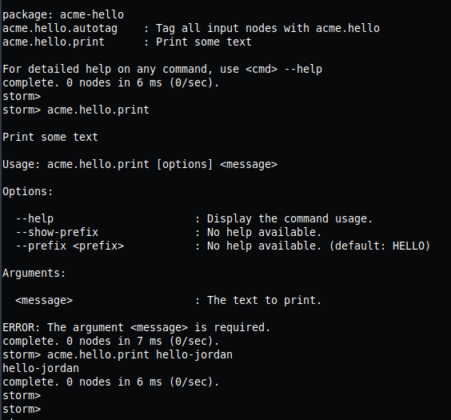

# Acme-Hello
```bash
* A Custom Storm Package
```

```bash
* USAGE
```
### run the test by
```bash
root@0a0b30151421:/data/Custom-Package/acme-hello# python -m pytest test_acme_hello.py
```
### now lets push our custom Storm Package to cortex so that we can use it in Storm Shell

```bash
root@0a0b30151421:/data/Custom-Package/acme-hello# python -m synapse.tools.genpkg acme-hello.yaml --push cell:///vertex/storage
```
### woot ! it got pushed , now lets test it if it works or not in Storm shell
```bash
root@0a0b30151421:/data/Custom-Package/acme-hello# python -m synapse.tools.storm cell:///vertex/storage

Welcome to the Storm interpreter!

Local interpreter (non-storm) commands may be executed with a ! prefix:
    Use !quit to exit.
    Use !help to see local interpreter commands.

storm> help
package: synapse
auth.role.add         : Add a role.
auth.role.addrule     : Add a rule to a role.
auth.user.add         : Add a user.
auth.user.addrule     : Add a rule to a user.
background            : Execute a query pipeline as a background task.
count                 : Iterate through query results, and print the resulting number of nodes
cron.add              : Add a recurring cron job to a cortex.
cron.at               : Adds a non-recurring cron job.
<--SNIP-->
<--SNIP-->
<--SNIP-->
<--SNIP-->
<--SNIP-->
<--SNIP-->
<--SNIP-->
<--SNIP-->
package: acme-hello
acme.hello.autotag    : Tag all input nodes with acme.hello
acme.hello.print      : Print some text

For detailed help on any command, use <cmd> --help
complete. 0 nodes in 16 ms (0/sec).
```
### Fantastic we can see our package has been imported to Storm shell without any issues
### now lets try it

```bash
storm> acme.hello.print

Print some text

Usage: acme.hello.print [options] <message>

Options:

  --help                      : Display the command usage.
  --show-prefix               : No help available.
  --prefix <prefix>           : No help available. (default: HELLO)

Arguments:

  <message>                   : The text to print.

ERROR: The argument <message> is required.
complete. 0 nodes in 37 ms (0/sec).
storm> acme.hello.print hello
hello
complete. 0 nodes in 45 ms (0/sec).
storm>
```
### Bingo it Works Fine !! <3 GG




